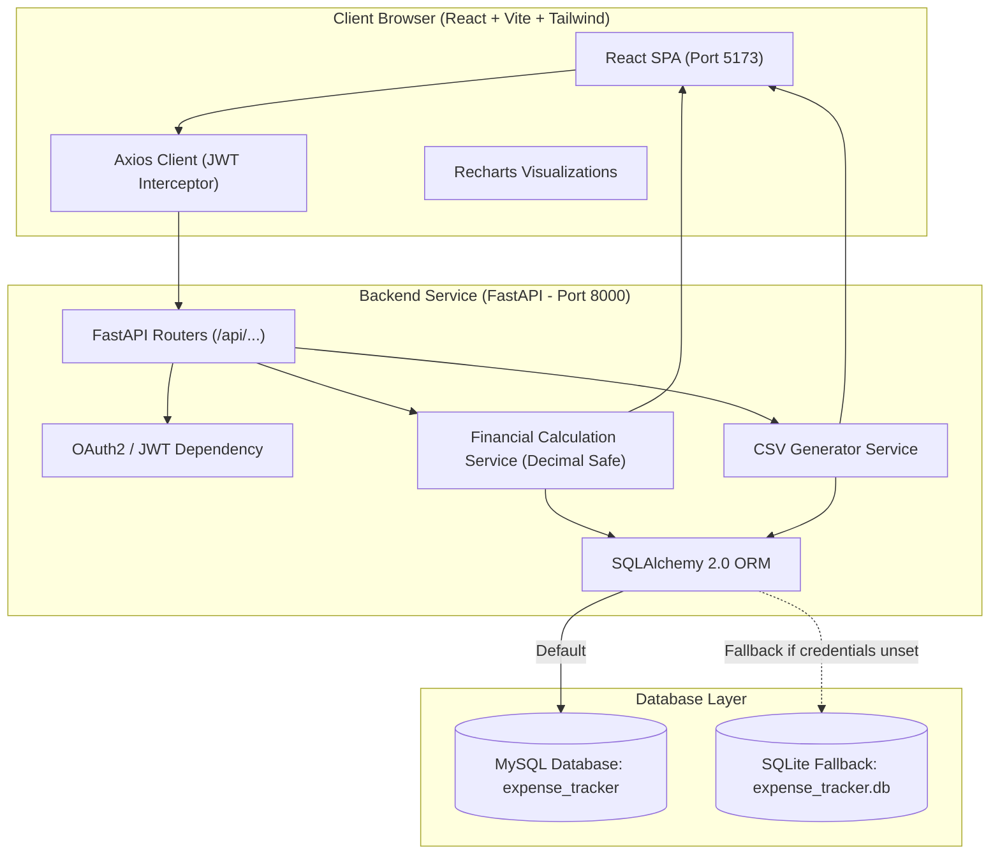

# EXPENSELY — Track. Understand. Save.

[](https://fastapi.tiangolo.com)
[](https://www.python.org)
[](https://react.dev)
[](https://vitejs.dev)
[](https://tailwindcss.com)
[](https://www.mysql.com)
[](https://opensource.org/licenses/MIT)

> **"Track. Understand. Save."**  
> A production-grade, full-stack personal finance application built with FastAPI, SQLAlchemy, React, Tailwind CSS, and MySQL. Designed as a serious portfolio project showcasing end-to-end full-stack development, decimal-safe financial calculations, multi-tenant data isolation, budgeting guardrails with automated alerts, interactive Recharts visualizations, and CSV exports.

---

## 📌 Table of Contents
1. [Project Overview](#-project-overview)
2. [Key Features](#-key-features)
3. [Technology Stack](#-technology-stack)
4. [Architecture & Data Flow](#-architecture--data-flow)
5. [Database Schema & ER Diagram](#-database-schema--er-diagram)
6. [Project Structure](#-project-structure)
7. [Installation & Getting Started](#-installation--getting-started)
8. [Database Initialization & Demo Seed](#-database-initialization--demo-seed)
9. [Demo Credentials](#-demo-credentials)
10. [API Documentation](#-api-documentation)
11. [Running Tests](#-running-tests)
12. [Financial Math & Decimal Safety](#-financial-math--decimal-safety)
13. [Security Highlights](#-security-highlights)
14. [Future Scope](#-future-scope)
15. [Author & License](#-author--license)

---

## 🚀 Project Overview

**EXPENSELY** bridges the gap between basic spreadsheet tracking and full-scale personal financial analytics. It allows individuals to record income and expenses across distinct payment methods, categorize cash flows, set monthly budget ceilings with automatic 80% and 100% threshold warnings, inspect periodic trends, and export verified financial statements.

Every calculation is performed using decimal-safe arithmetic on the backend, ensuring zero floating-point accumulation errors.

---

## ✨ Key Features

- 🔐 **Authentication & Multi-Tenant Isolation**:
  - Secure registration and login with bcrypt password hashing and signed JWT bearer tokens.
  - Strict database-level tenant isolation: User A can never access, edit, or view User B's transactions or budgets.
- 💳 **Transaction Ledger**:
  - Add, edit, delete, search, filter (by type, category, payment method, date range), and sort (newest, oldest, highest, lowest).
  - Server-side paginated queries with responsive table and card layouts.
- 🛡️ **Budget Guardrails & Alert Thresholds**:
  - Establish monthly category-specific spending caps.
  - Real-time progress bars with non-judgmental status tags: `Under Budget`, `Near Limit` (at ≥80%), and `Over Budget` (at ≥100%).
  - Automatic dashboard alert banners for budgets approaching or exceeding capacity.
- 📊 **Real-Time Visual Analytics**:
  - Interactive Recharts: 6-month Income vs. Expense comparison, Category Spending Donut Chart, and Savings Velocity Trendline.
  - Top spending category rankings and executive monthly summary statements.
- 📑 **Standardized CSV Export**:
  - Download RFC-4180 compliant CSV exports reflecting current filters and search terms directly from the live database.
- 🏷️ **Category Management**:
  - Pre-seeded default categories (Salary, Freelance, Food, Transport, Bills, Shopping, etc.) plus full support for custom categories.
  - Built-in relational safeguards: prevents accidental deletion of categories that currently have dependent transactions.
- 🌓 **Dark Mode & Personalization**:
  - Full dark/light appearance toggle persisted to `localStorage`.
  - Multi-currency support (`INR ₹`, `USD $`, `EUR €`, `GBP £`) with dynamic formatting across all metrics.

---

## 🛠️ Technology Stack

| Layer | Technologies |
| :--- | :--- |
| **Frontend** | React 18, Vite, React Router v6, Axios, Tailwind CSS, Lucide React, Recharts |
| **Backend** | Python 3.11+, FastAPI, SQLAlchemy 2.0, Pydantic v2, PyMySQL, PyJWT, Bcrypt |
| **Database** | MySQL (with automatic local SQLite fallback for immediate evaluation) |
| **Testing** | Pytest, FastAPI TestClient, HTTPX |
| **Tooling** | PostCSS, Autoprefixer, Git |

---

## 🏛️ Architecture & Data Flow



---

## 🗄️ Database Schema & ER Diagram

```mermaid
erDiagram
    USERS ||--o{ TRANSACTIONS : "records"
    USERS ||--o{ CATEGORIES : "owns"
    USERS ||--o{ BUDGETS : "allocates"
    USERS ||--|| USER_SETTINGS : "configures"
    CATEGORIES ||--o{ TRANSACTIONS : "classifies"
    CATEGORIES ||--o{ BUDGETS : "caps"

    USERS {
        int id PK
        string name
        string email UK
        string password_hash
        string currency
        datetime created_at
        datetime updated_at
    }

    CATEGORIES {
        int id PK
        int user_id FK "nullable for defaults"
        string name
        string type "income or expense"
        string icon
        datetime created_at
    }

    TRANSACTIONS {
        int id PK
        int user_id FK
        int category_id FK
        string type "income or expense"
        numeric amount "12,2"
        string title
        text description
        date transaction_date
        string payment_method
        datetime created_at
        datetime updated_at
    }

    BUDGETS {
        int id PK
        int user_id FK
        int category_id FK
        numeric amount "12,2"
        int month "1-12"
        int year
        datetime created_at
        datetime updated_at
    }

    USER_SETTINGS {
        int id PK
        int user_id FK UK
        string currency
        numeric monthly_income_target "12,2"
        datetime created_at
        datetime updated_at
    }
```

---

## 📁 Project Structure

```
expense-tracker/
│
├── backend/
│   ├── app/
│   │   ├── __init__.py
│   │   ├── main.py               # FastAPI application setup, CORS & error handlers
│   │   ├── database.py           # SQLAlchemy engine, session maker & SQLite fallback
│   │   ├── config.py             # Pydantic Settings & environment variables
│   │   ├── models/               # User, Category, Transaction, Budget, UserSettings
│   │   ├── schemas/              # Request/response validation schemas
│   │   ├── routers/              # Auth, Transactions, Budgets, Analytics, Dashboard, Profile
│   │   ├── services/             # Calculation, Export, and Seeding services
│   │   └── utils/                # Password hashing, JWT helpers, dependencies
│   ├── scripts/
│   │   └── seed.py               # Database seeder with realistic demo data
│   ├── tests/                    # Pytest test suite (13 comprehensive tests)
│   ├── requirements.txt
│   ├── .env.example
│   └── README.md
│
├── frontend/
│   ├── src/
│   │   ├── components/           # Navbar, Sidebar, StatCard, ProgressBar, Modal, etc.
│   │   ├── pages/                # Landing, Login, Register, Dashboard, Budgets, Analytics, etc.
│   │   ├── services/             # Centralized Axios client (api.js)
│   │   ├── context/              # AuthContext, ThemeContext, ToastContext
│   │   ├── hooks/                # useAuth, useTheme, useCurrency
│   │   ├── utils/                # Currency formatters, date formatters, constants
│   │   ├── App.jsx               # Routes and providers
│   │   ├── main.jsx              # React DOM mount point
│   │   └── index.css             # Tailwind CSS & custom scrollbars
│   ├── package.json
│   ├── vite.config.js
│   ├── tailwind.config.js
│   ├── .env.example
│   └── README.md
│
├── .gitignore
├── README.md
└── LICENSE
```

---

## 💻 Installation & Getting Started

### Prerequisites
- **Python 3.10+** (Tested on Python 3.14)
- **Node.js 18+** & **npm**
- **MySQL Server** (Optional for local testing — if credentials differ, the backend automatically engages SQLite without crashing)

---

### Step 1: Backend Setup

#### On Windows PowerShell:
```powershell
# 1. Navigate to backend
cd expense-tracker\backend

# 2. (Optional) Create and activate virtual environment
python -m venv venv
.\venv\Scripts\activate

# 3. Install backend dependencies
pip install -r requirements.txt

# 4. Copy environment example
Copy-Item .env.example .env

# 5. Initialize and seed database
python scripts\seed.py

# 6. Start the backend development server
uvicorn app.main:app --reload --host 127.0.0.1 --port 8000
```

#### On Windows Command Prompt (CMD):
```cmd
cd expense-tracker\backend
python -m venv venv
venv\Scripts\activate.bat
pip install -r requirements.txt
copy .env.example .env
python scripts\seed.py
uvicorn app.main:app --reload --host 127.0.0.1 --port 8000
```

Backend will be running at: **[http://127.0.0.1:8000](http://127.0.0.1:8000)**  
Interactive Swagger Docs: **[http://127.0.0.1:8000/docs](http://127.0.0.1:8000/docs)**

---

### Step 2: Frontend Setup

Open a second terminal window:

#### On Windows PowerShell / CMD:
```powershell
# 1. Navigate to frontend
cd expense-tracker\frontend

# 2. Install dependencies
npm.cmd install

# 3. Copy environment example
Copy-Item .env.example .env

# 4. Start Vite development server
npm.cmd run dev
```

Frontend will be running at: **[http://localhost:5173](http://localhost:5173)**

---

## 🔑 Demo Credentials

To evaluate the application immediately with realistic data (spanning multiple months, budgets, and categories):

| Credential | Value |
| :--- | :--- |
| **Email** | `demo@expensely.com` |
| **Password** | `Demo@12345` |

> *Tip: You can also click the **"Fill & Login"** button on the Login page to authenticate instantly.*

---

## 📖 API Documentation

The backend provides OpenAPI 3.0 documentation:
- **Swagger UI**: [http://127.0.0.1:8000/docs](http://127.0.0.1:8000/docs)
- **ReDoc**: [http://127.0.0.1:8000/redoc](http://127.0.0.1:8000/redoc)

### Core Endpoints Overview

| Method | Endpoint | Description | Protected |
| :--- | :--- | :--- | :---: |
| `POST` | `/api/auth/register` | Register a new user | No |
| `POST` | `/api/auth/login` | Authenticate & receive JWT token | No |
| `GET` | `/api/auth/me` | Fetch active user profile | Yes |
| `GET` | `/api/transactions` | Filterable, paginated transaction ledger | Yes |
| `POST` | `/api/transactions` | Record new transaction | Yes |
| `GET` | `/api/transactions/{id}` | Retrieve single transaction | Yes |
| `PUT` | `/api/transactions/{id}` | Update transaction | Yes |
| `DELETE` | `/api/transactions/{id}` | Remove transaction | Yes |
| `GET` | `/api/transactions/export` | Download filtered records as CSV | Yes |
| `GET` | `/api/budgets` | Fetch monthly budgets with usage percentages | Yes |
| `POST` | `/api/budgets` | Create or update budget | Yes |
| `GET` | `/api/dashboard/summary` | Real-time KPI cards & warning alerts | Yes |
| `GET` | `/api/analytics/monthly` | 6-12 month cash flow trendlines | Yes |
| `GET` | `/api/analytics/categories`| Category spending breakdown | Yes |
| `GET` | `/api/categories` | List user & system categories | Yes |
| `POST` | `/api/categories` | Add custom category | Yes |
| `PUT` | `/api/profile` | Update profile information | Yes |
| `PUT` | `/api/profile/password` | Secure password update | Yes |
| `GET` | `/api/settings` | Retrieve user preferences | Yes |
| `PUT` | `/api/settings` | Save currency & income goals | Yes |

---

## 🧪 Running Tests

A comprehensive Pytest test suite validates authentication, JWT enforcement, decimal precision math, budget alert thresholds, cross-tenant isolation, and CSV export:

```powershell
cd expense-tracker\backend
python -m pytest tests -v
```

### Test Suite Coverage:
- `test_auth.py`: Registration, duplicate email rejection, password confirmation validation, login, token issuance.
- `test_transactions.py`: CRUD operations, positive amount validation, filtering by type/category/payment method.
- `test_isolation.py`: Cross-tenant boundary verification — User B cannot read, edit, or delete User A's transactions or budgets.
- `test_budgets.py`: 80% (`Near Limit`) and 100% (`Over Budget`) automatic alert threshold triggers.
- `test_calculations.py`: Total balance, net savings, and savings rate arithmetic accuracy.
- `test_export.py`: RFC-4180 CSV export headers and data integrity.

---

## 🧮 Financial Math & Decimal Safety

To prevent floating-point rounding errors common in monetary applications (e.g. `0.1 + 0.2 = 0.30000000000000004`), the backend implements:
- `Numeric(12, 2)` columns in database storage.
- Python `Decimal` quantization (`ROUND_HALF_UP`) in the calculation service.
- Exact formulas:
  $$\text{Total Balance} = \sum \text{Income} - \sum \text{Expense}$$
  $$\text{Monthly Savings} = \text{Monthly Income} - \text{Monthly Expense}$$
  $$\text{Savings Rate} = \left( \frac{\text{Monthly Savings}}{\text{Monthly Income}} \right) \times 100 \quad (\text{if Income} > 0)$$

---

## 🔒 Security Highlights

1. **Password Security**: Strong hashing using `bcrypt` with unique salt generation.
2. **Stateless JWT**: Signed using `HS256` with configurable expiration.
3. **No Frontend Trust**: The user ID is always extracted securely from the verified JWT payload; frontend-supplied IDs are never trusted.
4. **Error Sanitization**: Server exceptions are caught by centralized FastAPI exception handlers, returning clean human-readable JSON messages without exposing internal stack traces.

---

## 🔮 Future Scope

The following features can be added in future iterations:
- Recurring transactions and subscription renewal reminders.
- Receipt scanning using OCR.
- Multi-user shared household finance tracking.
- Native mobile application using React Native.
- Bank API integration via Open Banking.

---

## 📄 License

This project is licensed under the [MIT License](LICENSE).
